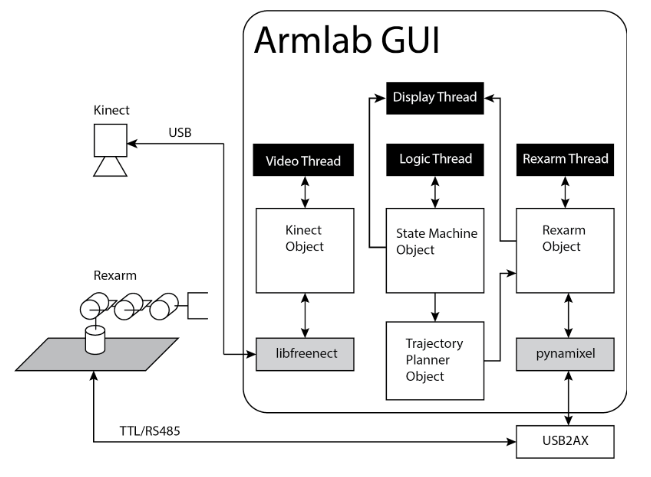
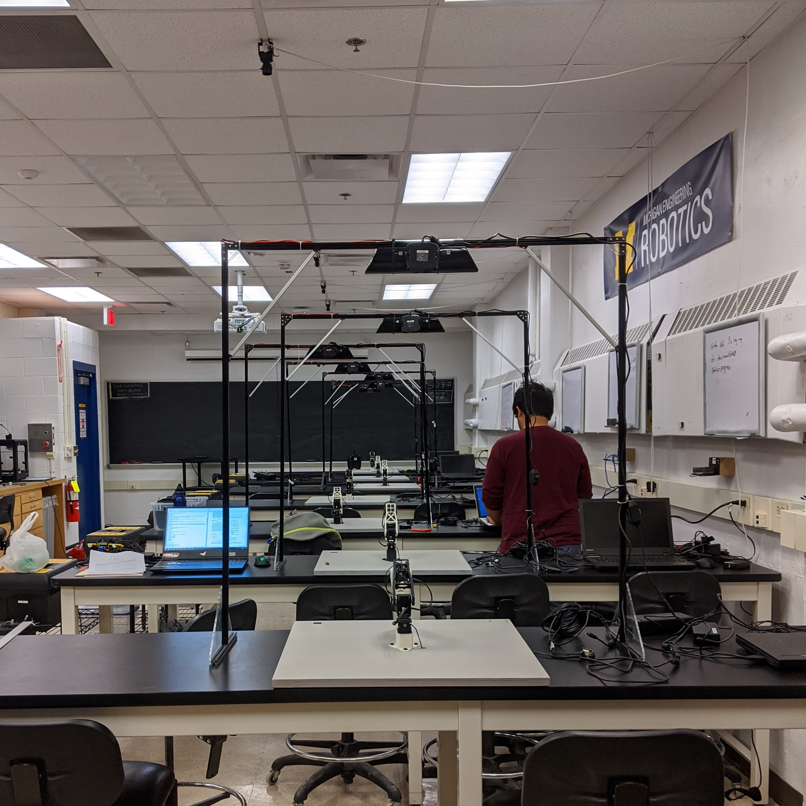

# 6-DOF Serial Link Robotic Manipulator

A project for ROB 550: Robotics Systems Lab course taught in University of Michigan, Ann Arbor. An overview of this project:
##### Acting
- 6-DOF rigid-body coordinate transforms using homogeneous coordinate transforms
- Forward kinematics modeling of a manipulator
- Inverse kinematics modeling of a manipulator
- Grasping

##### Perception 
- 3D image/workspace calibration
- Object detection with OpenCV
- Depth camera sensors

##### Reasoning
- Path planning & path smoothing
- State machines

The whole pipeline can be explained by the following figure: 

### Running the code

1. `./control_station`
1. `freenect-cppview` -- run this program and make sure the kinect is streaming both video and depth data

### Directories and Codebase 

| Files                 | Description   |
| -------------         | -------------  |
| `control_station.py`    | Main program.  Sets up threads and callback functions.  |
| `rexarm.py`             | Implements the Rexarm and Joint class |
| `test/test_rexarm.py`   | Script to verify FK and IK and test functions in the rexarm class without being connected to the rexarm.|
| `config/rexarm_config.csv` | This file is used to configure your rexarm links. |
| `kinect.py` | Implements Kinect class. This class contains:<ul><li>functions to capture and convert frames</li><li>functions to load camera calibration data </li><li>functions to find and  perform 2D transforms </li><li>functions to perform world->cam and cam->world transforms </li><li>functions to detect blocks in the depth and rgb frames </li></ul>|
| `test/test_kinect.py` | Script to test out computer vision code without being connected to the rexarm and the `control_station.py` GUI.|
| `test/test_gripper.py` | Script to test the gripper functionality without loading the GUI.|
| `state_machine.py` | Implements the StateMachine class|
| `trajectory_planner.py`| Implements the TrajectoryPlanner class|
| `kinematics.py`| Implements functions for forward and inverse kinematics.|
| `armlab_gui.ui`| This file defines the GUI interface, created using QtCreator. To compile a new ui.py file run, `pyuic4 mainWindow.ui -o ui.py`|
| `ui.py`| Output from QtCreator with GUI implementation in Python. |
| `utils/camera_cal.py`| Standalone program to generate camera distortion parameters and camera intrinsic matrix after calibrating with a checkerboard.|

### Lab setup

### Teach 'n Play (on an Operations board)

### Collaborators
[Saptadeep Debnath](https://www.linkedin.com/in/saptadeep-deb/), [Pradeep Suresh](https://www.linkedin.com/in/prad33p/) and [Yuping Wang](ypw@umich.edu).

